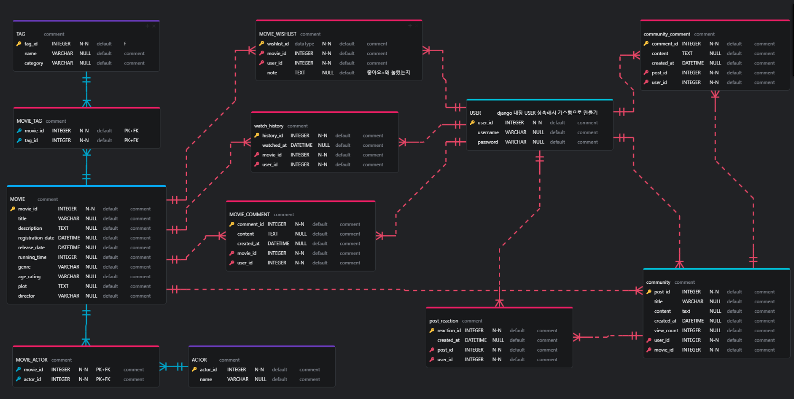

# SSAFY 1학기 관통 프로젝트

## 프로젝트 결과

### 1. 서비스 설명 및 기획 의도

* 서비스 명 :
  
  WARM - Weather And Region Movie 의 약자로, 위치 기반 날씨 데이터 바탕의 영화 추천 서비스

* 기획 의도 : 

  일반적인 추천 알고리즘에서 벗어나 사용자의 실제 주변 환경을 고려한 알고리즘의 필요성을 느낌. 여러 요소 중 날씨라는 환경 요소를 선택해 알고리즘에 접목하고,
  실시간 날씨 데이터를 활용하여 개인화된 사용자 맞춤형 데이터를 바탕으로
  사용자에게 편리함을 제공하고자 함.

### 2. 팀 및 역할 분담

* 프로젝트 진행 날짜 : 2024-11-18 ~ 2024-11-27

* 역할 분담

    | 팀원   | 업무 내용                                                    |      |
    | ------ | ------------------------------------------------------------ | ---- |
    | 김희수 | 1. 영화 리스트 페이지 및 상세 페이지 구현, 영화 데이터 fixtures 만들기, 메인 페이지 구현, 나의 기록 페이지 구현, 디자인, CSS |      |
    | 노진원 | 1. ERD 모델구성, 회원단, 커뮤니티 전체 기능 구현, 날씨 기반 알고리즘 구현, 애니메이션 효과, 검색 기능, CSS |      |

 
### 3. 목표 서비스 구현 및 진행 상황

* 인증 및 추천 알고리즘 구현
  - Django의 내장 인증 시스템 사용, 세션 기반 인증 활용
  - 알고리즘은 API를 통해 지역, 날씨 데이터를 수집하여 필요한 정보들을 매핑, 사용자가 직접 장르를 선택하여 해당 선호도에 따른 가중치 값으로 한 번 더 필터링 진행 후 추천

* 회원단 관련 기능
  - 회원가입
  - 회원탈퇴
  - 로그인
  - 로그아웃
  - 비밀번호 찾기

* 영화 관련 기능
  - 메인 알고리즘을 이용한 영화 추천 기능 > 선호 장르 및 날씨, 위치로 필터링 된 상태에서 온도 가중치로 한 번 더 필터링
  - 영화 장르별 노출 기능
  - 영화 디테일 페이지 + 댓글 작성 및 삭제 기능
  - 영화 찜(좋아요) 기능 > 영화 리스트가 노출되는 모든 페이지에서 연동
  - 장르별 best 영화 노출
  - 랜덤 영화 추천 기능

* 커뮤니티 기능
  - 게시글 작성 및 수정, 삭제 기능
  - 게시글 댓글 및 대댓글 작성, 삭제 기능
  - 게시글 추천 및 조회수 기능

* 기타 -> 나의 기록
  - 내가 찜(좋아요) 한 영화, 내가 작성한 영화 댓글 및 커뮤니티 작성 글, 댓글, 대댓글을 모아서 확인할 수 있는 기능

* 추가 기능 구현
  - 아이디 찾기
  - 비밀번호 찾기
  - 다크 모드
  - 반응형

### 4. ERD




### 5. 기능

#### 

#### A. 회원단 - 회원가입 / 회원탈퇴 / 로그인 / 로그아웃

1) 회원가입

* django의 기본 유저모델을 상속한 CustomUserModel 생성
  
* CustomUserModel을 통해 CustomUserCreationForm을 생성
  * CustomUserCreationForm에서 회원 가입에 필요한 Username. password1, password2, nickname, email, name 의 설정을 진행

    * required=True, 최대 길이. label의 이름, 에러 메시지 등을 설정     
  
  * 각 필드의 에러메시지를 설정하여 한글 오류 메시지가 등장하도록 설정하였음
  
  * 위와 같이 생성한 CustomUserCreationForm 형태에 맞게 데이터를 입력하여 회원 가입 진행.
  * 회원가입 관련 에러 종류
    * 이메일과 비밀번호 유사성
    * 비밀번호1과 비밀번호2 불일치
    * 

  

2) 로그인

* 입력한 정보가 올바르지 않을 경우 로그인 불가 경고창으로 피드백 제공

* 관리자 계정 로그인 시 관리자 전용 버튼 노출 (영화 추가, 회원 관리)

* JWT 활용

* 로그인 시 로그인한 사용자 정보를 store에 저장

  

3) 로그아웃

* 로그아웃 시 store에 저장된 사용자 정보 초기화


#### B. 영화 리스트, 영화 상세 정보 페이지

1) 영화 리스트

* 로그인하지 않은 일반 사용자도 조회는 가능하지만, 찜이나 댓글 등의 기능 차단

* TMDB의 데이터를 기반으로, 해당 사이트 기준 인기 영화 조회 가능

* 장르별로 분류 가능

* 해당 페이지에서 검색 가능


2) 해당 영화 리뷰 조회

* 영화의 상세 정보 조회 가능한 페이지로 개봉일, 러닝타임, 줄거리 등 조회 가능

* 해당 페이지에서 댓글 작성 가능 -> 본인이 쓴 댓글의 경우 삭제 가능


#### C. 날씨 추천 알고리즘 페이지

1) 영화 리뷰 작성


* 로그인 한 사용자에 대해 리뷰 Form 노출

* 관리자의 경우 리뷰 조작을 막기 위해 리뷰 기능 사용 불가

* 평점 입력에 대한 다양한 방법 제공과 실시간 적용으로 시각적 피드백 제공

* TMDB에서 정보를 받아와서 DB에 저장한상태고 우리 사이트에서 서비스를 하게 되면서 평점이 반영된다.

* 추천 수도 반영이 즉각적으로 이루어짐

  


2) 영화 리뷰 수정


* 작성자와 로그인 사용자가 같을 경우 수정 버튼 활성화
* 이전 작성 데이터를 제공

3) 영화 리뷰 삭제

* 작성자와 로그인 사용자가 같을 경우 삭제 버튼 활성화


#### D. 커뮤니티 게시판


1) 게시판 목록

* 게시글의 목록을 보여준다.

  

2) 글 등록

* 로그인한 사용자만 글 등록 가능


3) 글 수정


* 작성자와 로그인한 유저가 같을 경우 수정 버튼 활성화

* 수정 시 기존 데이터를 Form에 채워줌으로써 편리성 제공

  

4) 글 삭제

* 작성자와 로그인한 유저가 같을 경우 수정 버튼 활성화
* 관리자 로그인 시 모든 글에 대한 삭제 권한을 가짐


#### E. 메인 및 나의 기록 페이지


1) 메인 페이지

* 게시글의 목록을 보여준다.

  

2) 글 등록

* 로그인한 사용자만 글 등록 가능


3) 글 수정


* 작성자와 로그인한 유저가 같을 경우 수정 버튼 활성화

* 수정 시 기존 데이터를 Form에 채워줌으로써 편리성 제공

  

4) 글 삭제

* 작성자와 로그인한 유저가 같을 경우 수정 버튼 활성화
* 관리자 로그인 시 모든 글에 대한 삭제 권한을 가짐


#### F. [추가기능] 비밀번호 찾기 기능 / 검색 기능 / 애니메이션 효과 / 도시 이름 입력 / 다크모드 기능


1) 비밀번호 찾기 기능


* 현재 사이트에 등록된 영화 리스트 조회 가능
* 페이지네이션을 통해 다량의 데이터를 깔끔하게 표현


1) 검색 기능


* 현재 사이트에 등록된 영화 리스트 조회 가능
* 페이지네이션을 통해 다량의 데이터를 깔끔하게 표현


### 6. 느낀 점

#### 1) New

* 예시!!!!예시!!!!예시!!!!예시!!!!예시!!!!예시!!!!예시!!!!예시!!!!예시!!!!

  

#### 2) 오류, 어려웠던 점 및 해결 (트러블 슈팅!)

* 노진원 :
  
  예시!!!!예시!!!!예시!!!!예시!!!!예시!!!!예시!!!!예시!!!!예시!!!!예시!!!!

* 김희수 : 
  
  예시!!!!예시!!!!예시!!!!예시!!!!예시!!!!예시!!!!예시!!!!예시!!!!예시!!!!

    

#### 3) 후기

* 김희수 : 

  예시!!!!
  초기에 모델 설계를 탄탄하게 했다고 생각했는데, 막상 구현을 시작해 보니 기능이 추가되고 변경되면서 모델이 변경되는 경우들이 있었다. 개발 과정에서는 Agile방식이 적절하다고 느꼈고 언제든지 설계가 변경될 수 있다는 인식이 생겼다.  

* 노진원 :

  예시!!!!
  초기에 모델 설계를 탄탄하게 했다고 생각했는데, 막상 구현을 시작해 보니 기능이 추가되고 변경되면서 모델이 변경되는 경우들이 있었다. 개발 과정에서는 Agile방식이 적절하다고 느꼈고 언제든지 설계가 변경될 수 있다는 인식이 생겼다.


## 개발환경

### 1. 개발 환경

#### A. 언어

* Python 3.9.x
* Django 4.2.x
* Node.js LTS
* Vue 3

#### B. 도구

* vsCode
* Chrome Browser

#### C. 아키텍쳐

* ‘Django’ & ‘Vanilla JavaScript’ (또는 CDN 방식의 Vue)


### 2. 환경 추가 설정

**필수** 사전 생성 파일

* `.env` 

  * 생성 경로 : pjt/.env

  ```
  TMDB_API_KEY=TMDB키값

  OPENWEATHERMAP_API_KEY=날씨 데이터 api key
  
  OPENAI_API_KEY=생성형 ai api key
  
  COURIER_API_KEY=비밀번호 찾기 관련 메일 api key
  ```

  
  
----


## 개발 Tip 정리 (팀원용)


### 김희수
### 1. 화면에 pk 숫자 대신 username 출력하는 방법

일반적으로 아래와 같이 models.py를 정의할 때 테이블에 user를 ForiegnKey로 잡는다.


이렇게 하게 되면 user의 pk가 테이블 데이터가 저장이 되고, 시리얼라이징을 통해 vue로 값을 전달할 때 user의 username이 전달되는 것이 아니라 pk인 숫자가 전달된다.


위와 같이 시리얼라이저를 만들 때, user로 하기 때문에 자연스럽게 pk 값만 들어가고 전달이 되는 것

따라서 **유저 시리얼라이저를 만들고 'user'에 매핑할 user 객체를 생성해주면 된다. **


1. `get_user_model` 을 import한다. (User를 직접 불러오지 않고 안전하게 get_user_model을 써야 함)

   ```python
   from django.contrib.auth import get_user_model
   ```

2. User에서 가져오고 싶은 값을 골라서 Serializer 클래스를 만든다.

3. 원래 있던 시리얼라이저에 내가 만든 **User시리얼라이저 인스턴스 생성**

   * 이 때 인스턴스의 이름은 반드시 **<u>필드의 컬럼명과 동일해야 한다.</u>**

* 결과 화면

  

**※주의사항 : 이렇게 데이터를 전송했을 경우, vue 에서 타입을 undefined로 잡는 경우가 있다. 따라서 이럴 경우에는 템플릿이 아닌 함수에서 username 을 직접 this변수에 저장해서 그대로 출력한다.**


#### ManyToMany필드에서 여러 값을 보낼 때도 같은 방법을 사용한다. 

단, 여러 값이 들어가므로 커스터마이징한 인자에 `many=True` 를 설정해준다. 


### 노진원
### 1. 화면에 pk 숫자 대신 username 출력하는 방법

일반적으로 아래와 같이 models.py를 정의할 때 테이블에 user를 ForiegnKey로 잡는다.


이렇게 하게 되면 user의 pk가 테이블 데이터가 저장이 되고, 시리얼라이징을 통해 vue로 값을 전달할 때 user의 username이 전달되는 것이 아니라 pk인 숫자가 전달된다.
